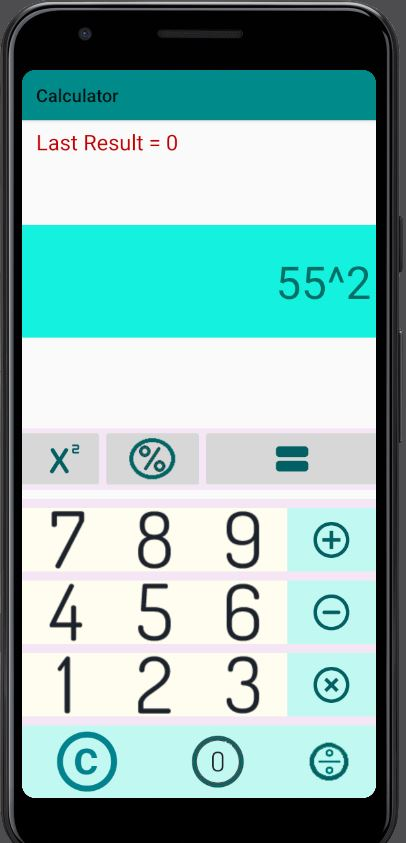

# Android JAVA CALCULATOR

This Application able to perform arithmetic operation like 
- Addition
- Subtraction
- Multiplication
- Division
- Modulus 
- Power(Exponent)

## Tech Used 
- Java Backend 
- XML For UI
<br>
IDE-> Android Studio
<br>
Supported In Android Version >=5

## Additional Feature
- User can save last result of calculation.
- User can clear result by reset symbol ("C")
- Multi Digit Calculator (Operand can be perform on more than one digit number)
- Check For ZeroDivisionError (a/0 is infinite that can't be stored, so ans will give zero division error, that is reason we also can't find a%0 for some integer 'a'.)

## Steps To Run
1. Clone this Project
2. Open Project In Android Studio having Android Support >=5 And All Necessary SDK Tools And Libraries.
3. Build This Project By Clicking Build Button on Android Studio
4. Create Emulator to run this App in Virtual Device  OR You can use your Mobile as Emulator( Search It On Google for Steps)
5. After Creating Emulator, Now Click Play Button in Android Studio(Beside Emulator Name)
6. It will take some time as building and running of app depends on Hardware performance. For having faster running of application without any latency/overhead, you should use pc having 16+ GB RAM , And Should have 4+ Processors.
7. When App Installation Completed, Calculator Application Open in Emulator ,Where You can Perform Any Arithmetic Operation

*note* You can use any other IDE.

## UI
1. When you will start app, It will show following menu.
<br><br>


2. Now doing Addition Operation that is 5+6 in this case by clicking "+" icon.
<br><br>


3. You will get 11 as output for previous operation, now multiplying previous ans with 5 by clicking "X" icon.
<br><br>


4. You will get 55 as output for previous operation, now taking previos ans exponent with 2 by clicking "X^2" icon .
<br><br>
```
NOTE -> X^2 Icon doesn't only to squaring, it can do a^b operation where(b>=0), By Mistake i have choosen wrong icon for 
exponenet that denote only squaring. Well this is not major issue, Later on I will replace it with "^" Icon. 
``` 


5.  You will get 3025 as output for previous operation, now to save ans click equal operator("=" icon) and ans will be saved as shown.
```
Last Result = 3025
```
<br><br>


6. Adding 99 with 333 (for Demonstrating Multi Digits Operation).
<br><br>


7. You will get output 432 for previous operation,now dividing ans by 3 by clicking divide symbol.
<br><br>


8.  You will get Previous output as 144 that is now dividing with 0 by clicking divide symbol (For Demonstrating Zero Division Error).
```
a/0 or a%0 will show zero division error and hence all value will get reset to 0 after clicking any other digit or clear icon.
```
<br><br>


9. Showing output of previous operation.
<br><br>


10. You can reset last save data and current operation by clicking "C" Symbol and you will get below result.
<br><br>


## Future Scope

- This App Performing All task in main thread that cause freezing( delayed) in Application, To Solve this , need for multithreading.
- This Is Basic Calculator can be extended with scientific and programming calculator by adding more functionalities.


